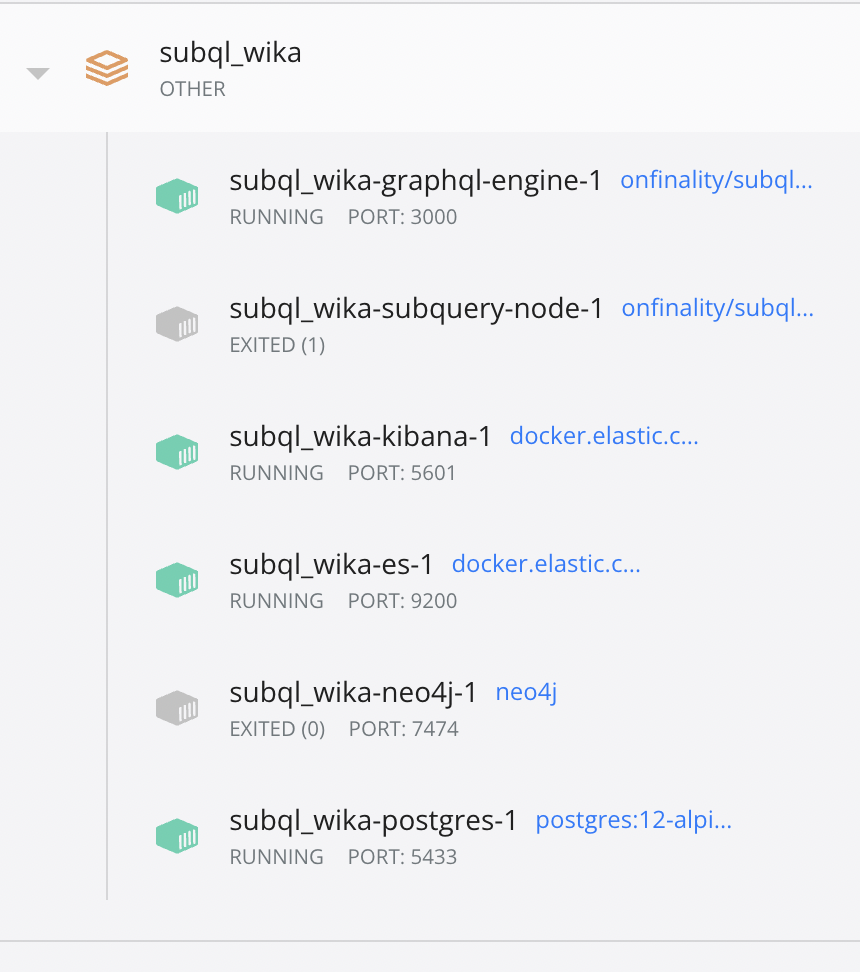
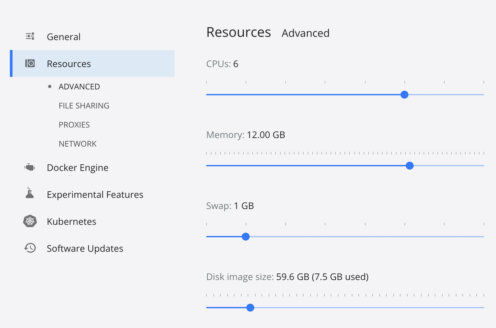

# Wika Network ETL trouble shooting

## processes exiting

If you experience one or more of the processes exiting, you may need to increase you docker resources.

For example, in docker desktop you might see this:



If that is the case, you might not be allocating enough resources to your docker image. 

To change this in docker desktop, navigate to the settings icon and the click resrouces. There you will see a menu that looks like below image. Increase the CPU and Memory until your image runs without exiting. The below settings were sufficient in testing on a macbook air m1.



## `graphql-engine` and or `subquery-node` containers won't start

1. `docker-compose down` everything
2. delete the `.data/postgres` folder
3. reset the `startBlock` in the `project.yml` file to a recent a block number
4. `docker-compose up` again

## graphql-engine Container is unhealthy

If you encounter this error:

```bash
ERROR: for graphql-engine  Container "824d8fc05142" is unhealthy.
```

You can fix it by:

1. shutting down the docker infrastructure & clean up
```bash
$ docker rm 824d8fc05142 # replace with the correct container id
$ docker-compose down
```

2. update the `startBlock` property to the recent block height

3. start the docker infrastructure again
```bash
$ docker-compose up
```
